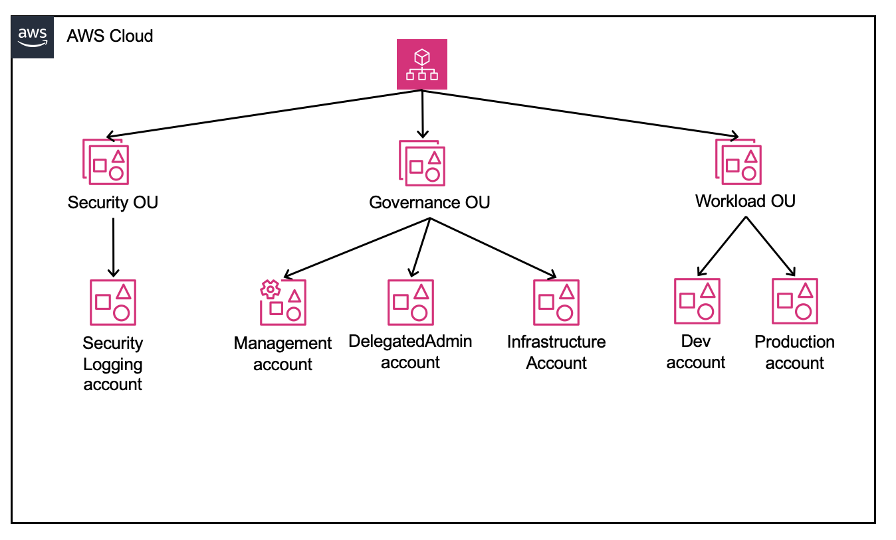

## Terraform repo for setting up AWS multi-account governance structure

### Overview
The goal of this repo is to only use terraform to create an AWS multi-account governance structure without doing any "ClickOps". The governance structure  utilizes the concept of [delegated administration](https://docs.aws.amazon.com/singlesignon/latest/userguide/delegated-admin.html), service control policies, and a three organization unit top-level (OU) structure.



### Directory structure
This is the directory structure of this repo.

```
├── delegatedadmin
├── mgmt
├── mgmt-workload
├── README.md
└── securitylogging
```

Each directory contains a separate Terraform configuration for different aspects of the AWS multi-account setup:
- `mgmt` : In the AWS Management Account, setup Organization, OUs, Delegated Administration, AWS accounts under Governance and Security OUs, an Identity Center user, and S3 bucket for storing terraform state file for resources created with root user email address.
- `delegatedadmin` : In the DelegatedAdmin AWS account as an Identity Center user with Administrator permissions, setup Delegated Administration for Identity Center and AWS Organizations and assign Service Control Policies (SCPs) to the Organization Root. Also, setup S3 bucket for storing terraform state file for this account.
- `securitylogging` : In the SecurityLogging AWS account as an Identity Center user with Administrator permissions, setup Security Logging account with CloudTrail and S3. Also, setup S3 bucket for storing terraform state file for this account.
- `mgmt-workload` : In the Management Account as an Identity Center user with Administrator permissions, setup AWS accounts under Workload OU and assign Identity Center Permission Sets to Groups for access to Workload accounts. 


### Setup

#### mgmt
1. Configure `aws configure --profile rootuser`, and use `aws login --profile rootuser` to login. Ensure that you are logged into browser with root user email.
2. Navigate to the `mgmt` directory.
3. Update the empty values in `variables.tfvars` file based on your environment. You can refer to the examples in the file.
template and fill in the required values
4. Initialize Terraform: `terraform init`
5. Review the plan: `terraform plan -var-file="variables.tfvars"`
6. Apply the configuration: `terraform apply -var-file="variables.tfvars"`. You will need to uncomment files one at a time in order to apply the configuration.

NOTE that the files in this directory have `.tf.1` extension. Since this is the "Management Account", this is purposefully done so that you can apply these terraform files one at a time and observe the order of operations when staring from an AWS account which has no resources inside it.

Please change the file extenstions to `.tf` in the following order and do `terraform plan ...` and `terraform apply ...`
1. `mv main.tf.1 main.tf ; mv centralize_root_access.tf.1`
2. `mv ou.tf.1 ou.tf`
3. `mv account_delegated_admin.tf.1 account_delegated_admin.tf`
4. `mv scp_delegation_policy.tf.1 scp_delegation_policy.tf`
5. `mv account_management_import_prep.tf.1 account_management_import_prep.tf`
6. `mv account_security_logging.tf.1 account_security_logging.tf`
7. `mv account_infrastructure.tf.1 account_infrastructure.tf`
8. `mv identity_center.tf.1 identity_center.tf`
9. `mv s3_for_terraform.tf.1 s3_for_terraform.tf` <-- for creating S3 bucket for storing terraform state file for this account.


#### securitylogging
NOTE: If you do not want to create CloudTrail and corresponding S3 bucket for saving costs, you can skip these steps.

1. Configure `aws configure --profile securitylogging-admin`, and use `aws login --profile securitylogging-admin` to login. Ensure that you are logged into browser as Identity Center user created before for the DelegatedAdmin account.
2. Navigate to the `securitylogging` directory.
3. Update the empty values in `variables.tfvars` file based on your environment. You can refer to the examples in the file.
4. Initialize Terraform: `terraform init`
5. Review the plan: `terraform plan -var-file="variables.tfvars"`
6. Apply the configuration: `terraform apply -var-file="variables.tfvars"`. You will need to uncomment files one at a time in order to apply the configuration.

Once done, `mv s3_for_terraform.tf.1 s3_for_terraform.tf` and `terraform apply ...` for creating an S3 bucket for terraform state file for this account.


#### delegatedadmin
NOTE: You will use this account for day to day operations of creating Identity Center groups and permission sets, and assigning users to groups.

1. Configure `aws configure --profile delegatedadmin-admin`, and use `aws login --profile delegatedadmin-admin` to login. Ensure that you are logged into browser as Identity Center user created before for the DelegatedAdmin account.
2. Navigate to the `delegatedadmin` directory.
3. Update the empty values in `variables.tfvars` file based on your environment. You can refer to the examples in the file.
4. Initialize Terraform: `terraform init`
5. Review the plan: `terraform plan -var-file="variables.tfvars"`
6. Apply the configuration: `terraform apply -var-file="variables.tfvars"`. You will need to uncomment files one at a time in order to apply the configuration.

Once done, `mv s3_for_terraform.tf.1 s3_for_terraform.tf` and `terraform apply ...` for creating an S3 bucket for terraform state file for this account.

#### mgmt-workload
NOTE: You will use this repository for day to day operations of assigning Identity Center groups and permission sets to AWS Accounts, as well as creating new AWS Accounts. You will do these operations as an Identity Center user with Administrator permission set assigned to the AWS Management Account.

1. Configure `aws configure --profile mgmt-admin`, and use `aws login --profile mgmt-admin` to login. Ensure that you are logged into browser as Identity Center user created before for the DelegatedAdmin account.
2. Navigate to the `mgmtadmin` directory.
3. Update the empty values in `variables.tfvars` file based on your environment. You can refer to the examples in the file.
4. Initialize Terraform: `terraform init`
5. Review the plan: `terraform plan -var-file="variables.tfvars"`
6. Apply the configuration: `terraform apply -var-file="variables.tfvars"`. You will need to uncomment files one at a time in order to apply the configuration.

Once done, `mv s3_for_terraform.tf.1 s3_for_terraform.tf` and `terraform apply ...` for creating an S3 bucket for terraform state file for this account.

## License
Copyright (c) 2025-2026 Salman Baset
This project is licensed under the Apache 2.0 license (https://www.apache.org/licenses/LICENSE-2.0)
